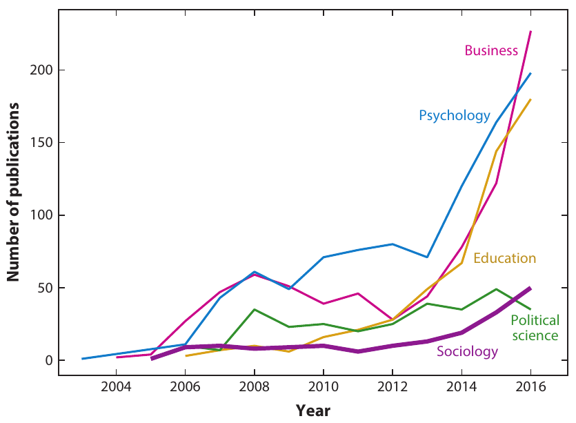

```{r setup, include=FALSE}
options(htmltools.dir.version = FALSE)
```

```{r xaringan-themer, include=FALSE}
library(xaringanthemer)
style_duo_accent(
  footnote_font_size = "0.5em",
  primary_color = "#28282B",
  #primary_color = "#7393B3",
  secondary_color = "#2c8475",
  black_color = "#4242424",
  white_color = "#FFF",
  base_font_size = "25px",
  # text_font_family = "Jost",
  # text_font_url = "https://indestructibletype.com/fonts/Jost.css",
  header_font_google = google_font("Libre Franklin", "200", "400"),
  header_font_weight = "200",
  inverse_header_color = "#eaeaea",
  title_slide_text_color = "#FFFFFF",
  text_slide_number_color = "#9a9a9a",
  text_bold_color = "#6A5ACD",
  code_inline_color = "#B56B6F",
  code_highlight_color = "transparent",
  link_color = "#2c8475",
  table_row_even_background_color = lighten_color("#345865", 0.9),
  extra_fonts = list(
    "https://indestructibletype.com/fonts/Jost.css",
    google_font("Amatic SC", "400")
  ),
  colors = c(
    green = "#31b09e",
    "green-dark" = "#2c8475",
    highlight = "#87f9bb",
    purple = "#887ba3",
    pink = "#B56B6F",
    orange = "#f79334",
    red = "#dc322f",
    `blue-dark` = "#002b36",
    `text-dark` = "#202020",
    `text-darkish` = "#424242",
    `text-mild` = "#606060",
    `text-light` = "#9a9a9a",
    `text-lightest` = "#eaeaea"
  ),
  extra_css = list(
    ".remark-slide-content h3" = list(
      "margin-bottom" = 0, 
      "margin-top" = 0
    ),
    ".smallish, .smallish .remark-code-line" = list(`font-size` = "0.7em")
  )
)
xaringanExtra::use_xaringan_extra(c("tile_view", "animate_css", "tachyons", "share_again"))
xaringanExtra::use_extra_styles()

```

```{r metadata, echo=FALSE}
library(metathis)
meta() %>% 
  meta_description("Investigación Social en la era digital, Universidad Católica del Maule, Agosto 01, 2023") %>% 
  meta_social(
    title = "Investigación Social en la era digital",
    url = "https://github.com/rcantillan/slides/tree/main/ciencias-sociales-computacionales/intro",
    image = "https://github.com/rcantillan/slides/tree/main/ciencias-sociales-computacionales/intro/ciencias-sociales-computacionales.png",
    twitter_card_type = "summary_large_image",
    twitter_creator = "ricantillan"
  )
```


```{r components, include=FALSE}
slides_from_images <- function(
  path,
  regexp = NULL,
  class = "hide-count",
  background_size = "contain",
  background_position = "top left"
) {
  if (isTRUE(getOption("slide_image_placeholder", FALSE))) {
    return(glue::glue("Slides to be generated from [{path}]({path})"))
  }
  if (fs::is_dir(path)) {
    imgs <- fs::dir_ls(path, regexp = regexp, type = "file", recurse = FALSE)
  } else if (all(fs::is_file(path) && fs::file_exists(path))) {
    imgs <- path
  } else {
    stop("path must be a directory or a vector of images")
  }
  imgs <- fs::path_rel(imgs, ".")
  breaks <- rep("\n---\n", length(imgs))
  breaks[length(breaks)] <- ""

  txt <- glue::glue("
  class: {class}
  background-image: url('{imgs}')
  background-size: {background_size}
  background-position: {background_position}
  {breaks}
  ")

  paste(txt, sep = "", collapse = "")
}
options("slide_image_placeholder" = FALSE)
```

class: left title-slide
background-image: url('d-koi-GQJY4UPR21U-unsplash.jpg')
background-size: cover
background-position: left

[remarkjs]: https://github.com/gnab/remark
[remark-wiki]: https://github.com/gnab/remark/wiki
[xaringan]: https://slides.yihui.org/xaringan/
[xaringan-wiki]: https://github.com/yihui/xaringan/wiki
[xaringanthemer]: https://pkg.garrickadenbuie.com/xaringanthemer
[xaringanExtra]: https://pkg.garrickadenbuie.com/xaringanExtra
[metathis]: https://pkg.garrickadenbuie.com/metathis
[ricantillan]: https://twitter.com/ricantillan
[rbind]: https://ricantillan.rbind.io
[rsthemes]: https://www.garrickdenbuie.com/projects/rsthemes
[regexplain]: https://www.garrickdenbuie.com/projects/regexplain
[shrtcts]: https://pkg.garricakdenbuie.com/shrtcts


## **Introducción a las  <br> Ciencias Sociales <br> Computacionales**

.side-text[
[&commat;ricantillan][ricantillan] | [rcantillan.rbind.io][rbind]
]

.title-where[
Universidad Católica del Maule<br>
Agosto 08, 2024
]

```{css echo=FALSE}
.title-slide h1 {
  font-size: 80px;
  font-family: Jost, sans;
  color: #6A5ACD;  /* Cambio del color del texto a morado */
}

.side-text {
  color: #6A5ACD;  /* Cambio del color del texto lateral a morado */
  transform: rotate(90deg);
  position: absolute;
  font-size: 22px;
  top: 150px;
  right: -130px;
}

.side-text a {
  color: #6A5ACD;  /* Cambio del color de los enlaces a morado */
}

.title-where {
  font-family: Jost, sans;
  font-size: 25px;
  position: absolute;
  bottom: 10px;
  color: #6A5ACD;  /* Cambio del color del texto de ubicación a morado */
}
```


```{r logo, echo=FALSE}
#library(xaringanExtra)
#use_logo(
#  image_url = "download.png",
#  exclude_class = c("title-slide","hide_logo","inverse"),
#  width = "150px",
#  height = "150px")
```

---
layout: false

# Sobre mi...

.f3[
&#x1F44B; Hola, Soy **Roberto Cantillan**
]

--

.f3[
&#x1F426; [&commat;ricantillan](https://twitter.com/ricantillan)
]

--

.f3[
&#x1F9D1;&#x200D;&#x1F4BB; [rcantillan.rbind.io](https://rcantillan.rbind.io)
]

--

.f3[
&#x1F4BC; [Sociología, Pontificia Universidad Católica de Chile](https://rstudio.com)
]

---
class: middle

# **Temas** 


- Big data, límites y oportunidades

--

- Ciencias Sociales Computacionales

--

- Nuevas estrategias de investigación

--

- Ciencias sociales y perspectiva analítica

--

---

class: middle right
background-image: url('d-koi-GQJY4UPR21U-unsplash.jpg')
background-size: cover

## **Ciencias Sociales computacionales**


---

class: middle left

## **Datos y era digital** 


- Poder transformador de la era digital: **Enorme  cantidad de datos (cada vez mayor) que se almacenan digitalmente, junto con el crecimiento paralelo en el poder de cómputo**. 

--

- A menudo los datos provienen de **rastros digitales**, resultantes de las acciones cotidianas de las personas.

--

- Los investigadores ahora pueden observar el comportamiento, hacer preguntas, realizar experimentos y colaborar de formas que no eran posibles en el pasado. 

--

- Los investigadores sociales deben combinar los enfoques tradicionales con las capacidades de la era digital.

--

- Comunmente, el "big data" incluye datos de empresas y gobiernos.

---

class: middle left

## **Datos y era digital II**

-  Sin embargo, esto plantea **preocupaciones éticas**, ya que los investigadores ahora pueden **observar y potencialmente dañar a las personas** sin su consentimiento o conocimiento.

--

- Tres estrategias principales de investigación para datos observacionales: **contar cosas, pronosticar cosas y aproximar un experimento**. 

--

- Los investigadores pueden usar datos 1) **listos para usar**, 2) **reutilizando datos** existentes creados por empresas y gobiernos, o 3) **datos personalizados**, generando datos específicamente para sus necesidades de investigación.

---
class: middle center


.footnote[
[1] http://drewconway.com/zia/2013/3/26/the-data-science-venn-diagram
]
---

class: middle center


.footnote[
[1] Salganik, M. J. (2018). Bit by bit: Social research in the digital age. Princeton University Press. https://www.bitbybitbook.com/
]
---
class: middle left

## **Ciencias Sociales Computacionales** 

- Mezclan ciencias computacionales y ciencias sociales. 

--

- A menudo, involucran cuestiones de éticas y de provacidad consideradas complejas

--

- Combinan **Readymanes and Custommades**

--

- Involucran 5 comnuidades claves: **Ciencias sociales**, **ciencias de datos**, **negocios**, **defensores de la privacidad**, **responsables políticos**. 

---
class: middle center



.footnote[
Edelmann, A., Wolff, T., Montagne, D., & Bail, C. A. (2020). Computational Social Science and Sociology. Annual Review of Sociology, 46(1), 61–81. https://doi.org/10.1146/annurev-soc-121919-054621
]

---

class: middle center 

.w-50.fl[
### 


]

.w-50.fr[
### 


.footnote[
Edelmann, A., Wolff, T., Montagne, D., & Bail, C. A. (2020). Computational Social Science and Sociology. Annual Review of Sociology, 46(1), 61–81. https://doi.org/10.1146/annurev-soc-121919-054621
]
]


---
class: middle right
background-image: url('d-koi-GQJY4UPR21U-unsplash.jpg')
background-size: cover


# **Ejemplos**


---
class: middle right

.w-40.fl[
### 


]

.w-40.fr[
### 


]

---

class: middle right

.w-40.fl[
### 


]

.w-40.fr[
### 


]

---


.footnote[
[1] https://github.com/sna-ses

[2] https://sna-ssla.netlify.app/
]

---
class: middle right
background-image: url('d-koi-GQJY4UPR21U-unsplash.jpg')
background-size: cover


# **Big data**
## **Características fundamentales**

---

class: middle left

# **I. Grandes** 

- Las fuentes de big data no son el objetivo final en sí mismas; se utilizan para lograr objetivos de investigación específicos.

> *Estudio de eventos raros*: grandes conjuntos de datos permiten a los investigadores estudiar eventos raros (sucesos que son poco frecuentes en la población).

--

> *Estudio de la heterogeneidad*: Big data permite la exploración de la heterogeneidad, donde los patrones y las relaciones difieren entre varios grupos o contextos.

--

> *Detección de pequeñas diferencias*: los grandes conjuntos de datos son efectivos para detectar pequeñas diferencias, que pueden ser valiosas para ciertas aplicaciones, como en la industria con fines de marketing.

---

class: middle center

# **II. Always on** 


---
class: middle center


---
class: middle left

# **III. No reactividad** 

.w-40.fl[
### 

- Las fuentes de big data pueden ser no reactivas

- Las personas no saben que sus datos se están registrando, lo que hace que sea menos probable que influya en su comportamiento

- ¿Posibles sesgos? 
  - *Desirability bias*
  - *Algorithmic confounding*
]

.w-40.fr[
### 


]

---
class: middle left

# **IV. Información faltante**

- los macrodatos pueden carecer de información crucial para la investigación social: 

> datos demográficos

--

> comportamiento en otras plataformas 

--

> datos para operacionalizar construcciones teóricas.


---
class: middle center


.footnote[
[1] Salganik, M. J. (2018). Bit by bit: Social research in the digital age. Princeton University Press.

]
---
class: middle left

# **V. Inaccesibles**

- Los datos en poder de empresas y gobiernos son difíciles de acceder para los investigadores

--

- Existen serias barreras legales, comerciales y éticas que impiden el acceso a los datos. Estas barreras no desaparecerán a medida que la tecnología mejore, porque no son barreras técnicas

--

- Algunos gobiernos nacionales han establecido procedimientos para habilitar el acceso a datos para algunos conjuntos de datos, pero el proceso es especialmente ad-hoc a nivel estatal y local

--

- Los investigadores pueden asociarse con empresas para obtener acceso a los datos, pero esto puede crear una variedad de problemas para los investigadores y las empresas (ej. problemas de reproducibilidad).


---
class: middle left

# **VI. No representatividad**


- Los macro datos pueden ser **no representativos** y, en efecto, pueden no ser adecuados para generalizar a toda la población (quien usa twitter?). 

--

- Para preguntas que requieren generalizar los resultados de la muestra a la población de la que se extrajo, este es un problema serio. 

--

- Pero para preguntas sobre comparaciones dentro de la muestra, los datos no representativos pueden ser poderosos (Estudio de John Snow 1853–54 brote de colera en Londres). 

--

- Para esto los investigadores gan claras las características de su muestra y respalden las afirmaciones sobre la transportabilidad con evidencia teórica o empírica. 

---
class: middle left

# **VII. Cambios (Deriva)**

- Los grandes sistemas de datos pueden cambiar con el tiempo

--

- Esto puede afectar la consistencia y confiabilidad de los datos recopilados.

--

  - deriva de la población (cambio en quién los usa)
  - deriva de comportamiento (cambio en la forma en que las personas los usan)
  - deriva del sistema (cambio en el sistema mismo)


---
class: middle left

## **VIII. Algorithmically confounded**


.w-50.fl[
### 

- El comportamiento en los sistemas de macro datos no es natural 

- Esta guiado por el diseño y la ingenieria de los sistemas

- Sesgos de comportamiento que guian el diseño (Homofilia, clausura triádica, etc. <sup>1</sup>)

]

.w-40.fr[
### 


]

.footnote[
[1] https://github.com/statnet
]

---

# **IX. Sucios**


.w-40.fl[
### 


]

.w-50.fr[
### 

- Las fuentes de big data se pueden cargar con basura y spam

- Muchas de estas fuentes de macrodatos nunca fueron pensadas para ser utilizadas para la investigación 

- No se recopilan, almacenan ni documentan de una manera que facilite la limpieza de datos <sup>1</sup>)

]

.footnote[
[1] Wickham H, Vaughan D, Girlich M (2023). tidyr: Tidy Messy Data. https://tidyr.tidyverse.org
]

---

# **X. Sensibles**


.w-50.fl[
### 

- Muchos de los datos que poseen las compañias y los gobiernos son muy sensibles. 

- Ejemplo del premio Netflix <sup>1</sup>. 

]

.w-40.fr[
### 


]

.footnote[
[1] https://www.cs.cornell.edu/~shmat/shmat_oak08netflix.pdf
]

---

class: middle right
background-image: url('d-koi-GQJY4UPR21U-unsplash.jpg')
background-size: cover

# **Muchas Gracias**
### **Esta presentación fue realizada con el paquete  [Xaringan](https://slides.yihui.org/xaringan), diseñado para entorno  [R](https://www.r-project.org/)** 


