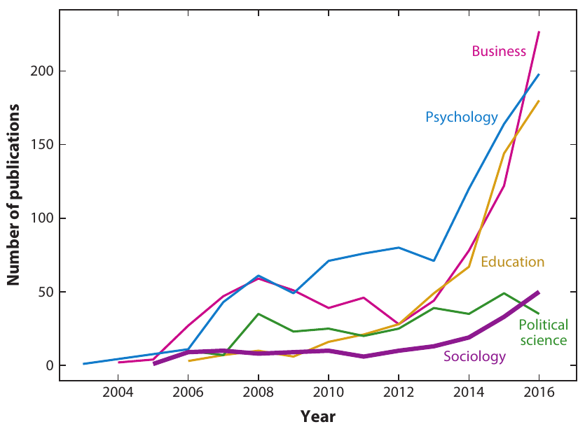

```{r setup, include=FALSE}
options(htmltools.dir.version = FALSE)
```

```{r xaringan-themer, include=FALSE}
library(xaringanthemer)
style_duo_accent(
  footnote_color = "#2c8475",
  footnote_position_bottom = "20px",
  footnote_font_size = "0.5em",
  primary_color = "#28282B",
  #primary_color = "#7393B3",
  secondary_color = "#2c8475",
  black_color = "#4242424",
  white_color = "#FFF",
  base_font_size = "25px",
  # text_font_family = "Jost",
  # text_font_url = "https://indestructibletype.com/fonts/Jost.css",
  header_font_google = google_font("Libre Franklin", "200", "400"),
  header_font_weight = "200",
    header_background_color = "#2c8475",
    header_background_text_color = "#2c8475",

  inverse_header_color = "#eaeaea",
  title_slide_text_color = "#FFFFFF",
  text_slide_number_color = "#9a9a9a",
  text_bold_color = "#6A5ACD",
  code_inline_color = "#B56B6F",
  code_highlight_color = "transparent",
  link_color = "#2c8475",
  table_row_even_background_color = lighten_color("#345865", 0.9),
  extra_fonts = list(
    "https://indestructibletype.com/fonts/Jost.css",
    google_font("Amatic SC", "400")
  ),
  colors = c(
    green = "#31b09e",
    "green-dark" = "#2c8475",
    highlight = "#87f9bb",
    purple = "#887ba3",
    pink = "#B56B6F",
    orange = "#f79334",
    red = "#dc322f",
    `blue-dark` = "#002b36",
    `text-dark` = "#202020",
    `text-darkish` = "#424242",
    `text-mild` = "#606060",
    `text-light` = "#9a9a9a",
    `text-lightest` = "#eaeaea"
  ),
  extra_css = list(
    ".remark-slide-content h3" = list(
      "margin-bottom" = 0, 
      "margin-top" = 0
    ),
    ".smallish, .smallish .remark-code-line" = list(`font-size` = "0.7em")
  )
)
xaringanExtra::use_xaringan_extra(c("tile_view", "animate_css", "tachyons", "share_again"))
xaringanExtra::use_extra_styles()

```

```{r metadata, echo=FALSE}
library(metathis)
meta() %>% 
  meta_description("Investigación Social en la era digital, Universidad Católica del Maule, Agosto 01, 2023") %>% 
  meta_social(
    title = "Investigación Social en la era digital",
    url = "https://github.com/rcantillan/slides/tree/main/ciencias-sociales-computacionales/intro",
    image = "https://github.com/rcantillan/slides/tree/main/ciencias-sociales-computacionales/intro/ciencias-sociales-computacionales.png",
    twitter_card_type = "summary_large_image",
    twitter_creator = "ricantillan"
  )
```


```{r components, include=FALSE}
slides_from_images <- function(
  path,
  regexp = NULL,
  class = "hide-count",
  background_size = "contain",
  background_position = "top left"
) {
  if (isTRUE(getOption("slide_image_placeholder", FALSE))) {
    return(glue::glue("Slides to be generated from [{path}]({path})"))
  }
  if (fs::is_dir(path)) {
    imgs <- fs::dir_ls(path, regexp = regexp, type = "file", recurse = FALSE)
  } else if (all(fs::is_file(path) && fs::file_exists(path))) {
    imgs <- path
  } else {
    stop("path must be a directory or a vector of images")
  }
  imgs <- fs::path_rel(imgs, ".")
  breaks <- rep("\n---\n", length(imgs))
  breaks[length(breaks)] <- ""

  txt <- glue::glue("
  class: {class}
  background-image: url('{imgs}')
  background-size: {background_size}
  background-position: {background_position}
  {breaks}
  ")

  paste(txt, sep = "", collapse = "")
}
options("slide_image_placeholder" = FALSE)
```

class: left title-slide
background-image: url('d-koi-GQJY4UPR21U-unsplash.jpg')
background-size: cover
background-position: left

[remarkjs]: https://github.com/gnab/remark
[remark-wiki]: https://github.com/gnab/remark/wiki
[xaringan]: https://slides.yihui.org/xaringan/
[xaringan-wiki]: https://github.com/yihui/xaringan/wiki
[xaringanthemer]: https://pkg.garrickadenbuie.com/xaringanthemer
[xaringanExtra]: https://pkg.garrickadenbuie.com/xaringanExtra
[metathis]: https://pkg.garrickadenbuie.com/metathis
[ricantillan]: https://twitter.com/ricantillan
[rbind]: https://ricantillan.rbind.io
[rsthemes]: https://www.garrickdenbuie.com/projects/rsthemes
[regexplain]: https://www.garrickdenbuie.com/projects/regexplain
[shrtcts]: https://pkg.garricakdenbuie.com/shrtcts


## **Introducción a las Ciencias Sociales <br> Computacionales <br> Clase II**

.side-text[
[&commat;ricantillan][ricantillan] | [rcantillan.rbind.io][rbind]
]

.title-where[
Universidad Católica del Maule<br>
Agosto 08, 2024
]

```{css echo=FALSE}
.title-slide h1 {
  font-size: 80px;
  font-family: Jost, sans;
  color: #6A5ACD;  /* Cambio del color del texto a morado */
}

.side-text {
  color: #6A5ACD;  /* Cambio del color del texto lateral a morado */
  transform: rotate(90deg);
  position: absolute;
  font-size: 22px;
  top: 150px;
  right: -130px;
}

.side-text a {
  color: #6A5ACD;  /* Cambio del color de los enlaces a morado */
}

.title-where {
  font-family: Jost, sans;
  font-size: 25px;
  position: absolute;
  bottom: 10px;
  color: #6A5ACD;  /* Cambio del color del texto de ubicación a morado */
}
```


```{r logo, echo=FALSE}
#library(xaringanExtra)
#use_logo(
#  image_url = "download.png",
#  exclude_class = c("title-slide","hide_logo","inverse"),
#  width = "150px",
#  height = "150px")
```

---
class: middle left

## **Orígenes y definición**

- Las ciencias sociales computacionales emergen en la intersección de las ciencias sociales tradicionales y las ciencias computacionales (Lazer et al., 2009).

- Definición: **"Campo interdisciplinario que avanza teorías del comportamiento humano aplicando técnicas computacionales a grandes conjuntos de datos de redes sociales, Internet u otros archivos digitizados"** (Edelmann et al., 2020, p. 62).

---
class: middle left

## **Hitos clave en su desarrollo**


.w-50.fl[
### 

- *2009*: Publicación del artículo seminal "Computational Social Science" en Science (Lazer et al., 2009).

- *2010-2015*: Expansión del uso de datos de redes sociales en investigación social.

- *2015-presente*: Integración creciente de métodos de aprendizaje automático en ciencias sociales.

]

.w-50.fr[
### 



]

.footnote[
[1] Edelmann, A., Wolff, T., Montagne, D., & Bail, C. A. (2020). Computational Social Science and Sociology. Annual Review of Sociology, 46(1), 61–81. https://doi.org/10.1146/annurev-soc-121919-054621

]


---
class: middle left

## **Áreas de aplicación en expansión**

- Análisis de redes sociales y formación de grupos
- Comportamiento colectivo y sociología política
- Sociología del conocimiento
- Sociología cultural y psicología social
- Producción cultural
- Sociología económica y organizaciones
- Demografía y estudios de población

.footnote[
[1] Edelmann, A., Wolff, T., Montagne, D., & Bail, C. A. (2020). Computational Social Science and Sociology. Annual Review of Sociology, 46(1), 61–81. https://doi.org/10.1146/annurev-soc-121919-054621
]
---
class: middle left

## **Cambios en las prácticas de investigación**

- Aumento en el uso de datos "encontrados" vs. datos "diseñados"
- Mayor énfasis en habilidades computacionales y programación
- Colaboraciones interdisciplinarias más frecuentes
- Nuevos desafíos éticos y de privacidad

---
class: middle left

## **Futuro y tendencias emergentes**

- Integración más profunda de métodos explicativos y predictivos (Hofman et al., 2021)
- Mayor atención a la causalidad en modelos de aprendizaje automático
- Desarrollo de infraestructuras para compartir datos y código
- Enfoque en la reproducibilidad y la ciencia abierta

.footnote[
[1] Hofman, J. M., Watts, D. J., Athey, S., Garip, F., Griffiths, T. L., Kleinberg, J., ... & Yarkoni, T. (2021). Integrating explanation and prediction in computational social science. Nature, 595(7866), 181-188.
]
---


class: middle right
background-image: url('d-koi-GQJY4UPR21U-unsplash.jpg')
background-size: cover

### **Oportunidades y desafíos de la <br> revolución digital en las ciencias sociales**

---
class: middle left

## **Transformación del panorama de investigación**

- Digitalización masiva de actividades sociales, económicas y culturales
- Generación de vastos repositorios de datos digitales
- Nuevas formas de observar y analizar el comportamiento humano a gran escala

.footnote[
Lazer, D., et al. (2009). Computational Social Science. Science, 323(5915), 721-723.
]

---
class: middle left

## **Oportunidades clave:**

.w-50.fl[
#### **Nuevas fuentes de datos y métodos**

- Acceso a datos de comportamiento en tiempo real y a gran escala
- Capacidad de estudiar interacciones sociales complejas
- Desarrollo de modelos predictivos más precisos
]

.w-50.fr[
#### **Investigación interdisciplinaria**

- Colaboración entre científicos sociales, informáticos y estadísticos
- Integración de teorías sociales con métodos computacionales avanzados
]

.footnote[
Edelmann, A., Wolff, T., Montagne, D., & Bail, C. A. (2020). Computational Social Science and Sociology. Annual Review of Sociology, 46(1), 61–81.
]

---
class: middle left

## **Desafíos metodológicos y técnicos**

.w-50.fl[
#### **Manejo de big data**

- Necesidad de nuevas habilidades en programación y análisis de datos
- Desafíos en el almacenamiento y procesamiento de grandes volúmenes de datos

]

.w-50.fr[
#### **Validez y representatividad**

- Preocupaciones sobre la calidad y representatividad de los datos digitales
- Riesgo de sesgos en muestras no probabilísticas

#### **Interpretación de resultados**

- Dificultad para distinguir entre correlación y causalidad en datos observacionales
- Riesgo de sobreajuste en modelos complejos
]

.footnote[
Salganik, M. J. (2018). Bit by Bit: Social Research in the Digital Age. Princeton University Press.
]

---
class: middle left

## **Desafíos éticos y de privacidad**

.w-50.fl[
#### **Consentimiento informado**

- Dificultad para obtener consentimiento en investigaciones con big data
- Uso de datos públicos vs. expectativas de privacidad de los usuarios
]

.w-50.fr[
#### **Anonimización y protección de datos**

- Riesgo de reidentificación en conjuntos de datos aparentemente anónimos
- Necesidad de nuevos protocolos para proteger la privacidad de los sujetos

#### **Sesgo y discriminación algorítmica**

- Potencial para perpetuar o amplificar desigualdades existentes
- Necesidad de auditoría ética de algoritmos y modelos predictivos
]

.footnote[
Buyalskaya, A., Gallo, M., & Camerer, C. F. (2021). The golden age of social science. Nature Human Behaviour, 5(1), 10-20.
]

---
class: middle left

### **El futuro de las ciencias sociales en la era digital**

.w-50.fl[
#### **Integración de métodos tradicionales y computacionales**

- Combinación de big data con encuestas y experimentos
- Desarrollo de métodos híbridos que aprovechen lo mejor de ambos enfoques

#### **Nuevas preguntas de investigación**

- Exploración de fenómenos sociales emergentes en entornos digitales
- Estudio de la interacción entre tecnología y sociedad
]

.w-50.fr[
#### **Hacia una ciencia social más abierta y colaborativa**

- Fomento de prácticas de ciencia abierta y reproducibilidad
- Creación de infraestructuras compartidas para datos y código
]

.footnote[
Hofman, J. M., et al. (2021). Integrating explanation and prediction in computational social science. Nature, 595(7866), 181-188.
]


---
class: middle left


```{r, echo = FALSE}
knitr::include_url("https://www.nature.com/immersive/d41586-019-03165-4/index.html")
```

[Estudio de `nature`](https://www.nature.com/immersive/d41586-019-03165-4/index.html)


---

class: middle right
background-image: url('d-koi-GQJY4UPR21U-unsplash.jpg')
background-size: cover

### **Nuevas preguntas y métodos <br> en la era del big data**

---
class: middle left

### **Transformación de las preguntas de investigación**

#### **Expansión del alcance y la escala**

- Capacidad de estudiar fenómenos sociales a escala global y en tiempo real
- Análisis de interacciones complejas entre múltiples variables

#### **Nuevos fenómenos sociales digitales**

- Estudio de comunidades online y redes sociales digitales
- Análisis de la difusión de información y desinformación en plataformas digitales

.footnote[
Lazer, D., et al. (2009). Computational Social Science. Science, 323(5915), 721-723.
]

---
class: middle left

### **Métodos emergentes en ciencias sociales computacionales**

#### **Análisis de redes sociales a gran escala**

- Mapeo de estructuras sociales complejas y su evolución temporal
- Identificación de influencers y patrones de difusión de información

#### **Análisis de texto y procesamiento del lenguaje natural**

- Análisis de sentimientos en grandes corpus de texto
- Detección de temas y tendencias en discursos públicos y medios sociales

#### **Métodos de aprendizaje automático**

- Modelos predictivos para comportamientos sociales
- Clasificación automática de contenido social y cultural

.footnote[
Edelmann, A., Wolff, T., Montagne, D., & Bail, C. A. (2020). Computational Social Science and Sociology. Annual Review of Sociology, 46(1), 61–81.
]

---
class: middle left

### **Integración de métodos tradicionales y computacionales**

#### **Combinación de big data con encuestas y experimentos**

- Uso de big data para informar el diseño de encuestas y experimentos
- Validación cruzada de hallazgos entre métodos tradicionales y computacionales

#### **Métodos mixtos digitales**

- Etnografía digital combinada con análisis de datos a gran escala
- Triangulación de métodos cualitativos y cuantitativos en entornos digitales

.footnote[
Salganik, M. J. (2018). Bit by Bit: Social Research in the Digital Age. Princeton University Press.
]

---
class: middle left

### **Nuevas áreas de investigación**

#### **Comportamiento humano en entornos digitales**

- Estudio de la formación de identidad y relaciones en espacios online
- Análisis de patrones de consumo y producción de contenido digital

#### **Impacto social de la inteligencia artificial y la automatización**

- Investigación sobre los efectos de la IA en el empleo y la desigualdad
- Estudio de la interacción humano-máquina en contextos sociales

#### **Dinámica de la opinión pública en la era digital**

- Análisis de la polarización política en redes sociales
- Estudio de la formación y cambio de opiniones en tiempo real

.footnote[
Buyalskaya, A., Gallo, M., & Camerer, C. F. (2021). The golden age of social science. Nature Human Behaviour, 5(1), 10-20.
]

---
class: middle left

### **Desafíos metodológicos y éticos**

#### **Validez y representatividad de los datos digitales**

- Desarrollo de métodos para evaluar y corregir sesgos en big data
- Técnicas de muestreo y ponderación para datos no probabilísticos

#### **Causalidad en la era del big data**

- Adaptación de métodos de inferencia causal a datos observacionales masivos
- Desarrollo de diseños cuasi-experimentales en entornos digitales

#### **Ética de la investigación con big data**

- Nuevos protocolos para el consentimiento informado en investigación digital
- Métodos para proteger la privacidad y anonimato de los sujetos de estudio

.footnote[
Hofman, J. M., et al. (2021). Integrating explanation and prediction in computational social science. Nature, 595(7866), 181-188.
]

---

class: middle right
background-image: url('d-koi-GQJY4UPR21U-unsplash.jpg')
background-size: cover

### **Tipos de datos digitales en <br> las ciencias sociales computacionales**


---
class: middle left

### **Introducción a los tipos de datos digitales**

#### **Diversidad de datos en la era digital**

- Textuales: contenido de redes sociales, artículos, documentos
- De red: conexiones sociales, interacciones online
- Geoespaciales: datos de ubicación, mapas digitales
- De comportamiento: registros de actividad online, sensores

#### **Impacto en la investigación social**

- Nuevas perspectivas sobre fenómenos sociales complejos
- Desafíos en el procesamiento y análisis de datos heterogéneos

.footnote[
Salganik, M. J. (2018). Bit by Bit: Social Research in the Digital Age. Princeton University Press.
]

---
class: middle left

### **Datos textuales**

#### **Características y fuentes**

- Contenido generado por usuarios en redes sociales
- Documentos digitalizados, artículos de noticias, blogs
- Transcripciones de entrevistas y grupos focales digitales

#### **Métodos de análisis**

- Procesamiento del lenguaje natural (NLP)
- Análisis de sentimientos y minería de opiniones
- Modelado de tópicos y análisis de discurso automatizado

.footnote[
Bail, C. A. (2014). The cultural environment: measuring culture with big data. Theory and Society, 43(3-4), 465-482.
]

---
class: middle left

### **Datos de red**

#### **Tipos y estructuras**

- Redes sociales online (ej. Facebook, Twitter)
- Redes de colaboración científica y profesional
- Redes de comunicación y difusión de información

#### **Técnicas de análisis**

- Análisis de redes sociales a gran escala
- Detección de comunidades y roles en redes
- Modelos de difusión y contagio social

.footnote[
Edelmann, A., Wolff, T., Montagne, D., & Bail, C. A. (2020). Computational Social Science and Sociology. Annual Review of Sociology, 46(1), 61–81.
]

---
class: middle left

### **Datos geoespaciales**

#### **Fuentes y aplicaciones**

- Datos de GPS de dispositivos móviles
- Información de ubicación en redes sociales
- Imágenes satelitales y mapas digitales

#### **Métodos de análisis**

- Sistemas de Información Geográfica (GIS)
- Análisis espacial y modelado geográfico
- Visualización de datos geoespaciales

.footnote[
Lazer, D., et al. (2009). Computational Social Science. Science, 323(5915), 721-723.
]

---
class: middle left

### **Datos de comportamiento**

#### **Tipos y recolección**

- Registros de actividad online y clics
- Datos de sensores en dispositivos móviles
- Registros de transacciones digitales

#### **Técnicas de análisis**

- Minería de patrones de comportamiento
- Modelos predictivos de comportamiento usuario
- Análisis de series temporales de actividad digital

.footnote[
Hofman, J. M., et al. (2021). Integrating explanation and prediction in computational social science. Nature, 595(7866), 181-188.
]
---
class: middle center 

#### **Cuadro resumen de tipos de datos digitales**

```{r, echo=FALSE, message=FALSE, warning=FALSE}
library(knitr)
library(kableExtra)

datos_digitales <- data.frame(
  Tipo = c("Textuales", "De red", "Geoespaciales", "De comportamiento"),
  Fuentes = c(
    "<ul><li>Redes sociales</li><li>Documentos</li><li>Transcripciones</li></ul>", 
    "<ul><li>Plataformas sociales</li><li>Redes de colaboración</li></ul>", 
    "<ul><li>GPS</li><li>Check-ins</li><li>Imágenes satelitales</li></ul>", 
    "<ul><li>Registros online</li><li>Sensores</li><li>Transacciones</li></ul>"
  ),
  Métodos = c(
    "<ul><li>NLP</li><li>Análisis de sentimientos</li><li>Modelado de tópicos</li></ul>",
    "<ul><li>Análisis de redes</li><li>Detección de comunidades</li></ul>",
    "<ul><li>GIS</li><li>Análisis espacial</li><li>Visualización</li></ul>",
    "<ul><li>Minería de patrones</li><li>Modelos predictivos</li></ul>"
  ),
  Aplicaciones = c(
    "<ul><li>Análisis de opinión</li><li>Estudio de discursos</li></ul>",
    "<ul><li>Estudio de influencia</li><li>Estructuras organizacionales</li></ul>",
    "<ul><li>Movilidad urbana</li><li>Segregación espacial</li></ul>",
    "<ul><li>Hábitos de consumo</li><li>Comportamiento online</li></ul>"
  )
)

kable(datos_digitales, format = "html", escape = FALSE) %>%
  kable_styling(bootstrap_options = c("striped", "hover", "condensed", "responsive"),
                font_size = 15) %>%
  column_spec(1, bold = TRUE) %>%
  scroll_box(width = "100%", height = "300px")
```

.footnote[
Resumen basado en Salganik, M. J. (2018), Bail, C. A. (2014), Edelmann, A., et al. (2020), Lazer, D., et al. (2009), y Hofman, J. M., et al. (2021).
]

---

class: middle right
background-image: url('d-koi-GQJY4UPR21U-unsplash.jpg')
background-size: cover

### **Características y potencial <br> de los datos digitales en la investigación social**

---
class: middle left

### **Características fundamentales de los datos digitales**

#### **Volumen**

- Cantidades masivas de datos disponibles
- Capacidad de estudiar fenómenos a gran escala

#### **Velocidad**

- Generación y actualización en tiempo real
- Posibilidad de análisis de eventos en curso

#### **Variedad**

- Diversidad de formatos y fuentes
- Integración de datos estructurados y no estructurados

.footnote[
Lazer, D., et al. (2009). Computational Social Science. Science, 323(5915), 721-723.
]

---
class: middle left

### **Granularidad y alcance de los datos digitales**

#### **Granularidad**

- Datos a nivel individual y de micro-interacciones
- Captura de comportamientos y decisiones en detalle

#### **Alcance**

- Cobertura de poblaciones grandes y diversas
- Potencial para estudios comparativos a escala global

#### **Longitudinalidad**

- Seguimiento de cambios a lo largo del tiempo
- Análisis de trayectorias y evolución de fenómenos sociales

.footnote[
Salganik, M. J. (2018). Bit by Bit: Social Research in the Digital Age. Princeton University Press.
]

---
class: middle left

### **Potencial para nuevos enfoques metodológicos**

#### **Análisis de redes a gran escala**

- Mapeo de estructuras sociales complejas
- Estudio de la difusión de información y comportamientos

#### **Aprendizaje automático y minería de datos**

- Descubrimiento de patrones ocultos en grandes conjuntos de datos
- Desarrollo de modelos predictivos de comportamiento social

#### **Visualización de datos complejos**

- Representación intuitiva de fenómenos sociales complejos
- Herramientas interactivas para exploración de datos

.footnote[
Edelmann, A., Wolff, T., Montagne, D., & Bail, C. A. (2020). Computational Social Science and Sociology. Annual Review of Sociology, 46(1), 61–81.
]

---
class: middle left

### **Desafíos y limitaciones de los datos digitales**

#### **Representatividad y sesgos**

- Problemas de muestreo y generalización
- Sesgos inherentes a las plataformas digitales

#### **Privacidad y ética**

- Consentimiento informado en entornos digitales
- Protección de datos personales y anonimización

#### **Volatilidad y accesibilidad**

- Cambios en las políticas de acceso a datos
- Necesidad de habilidades técnicas especializadas

.footnote[
Hofman, J. M., et al. (2021). Integrating explanation and prediction in computational social science. Nature, 595(7866), 181-188.
]

---
class: middle left

### **Potencial transformador para la teoría social**

#### **Prueba y refinamiento de teorías existentes**

- Verificación empírica a escalas sin precedentes
- Identificación de límites y condiciones de las teorías

#### **Desarrollo de nuevas teorías**

- Inspiración para conceptos y marcos teóricos novedosos
- Integración de perspectivas micro y macro en la teorización

#### **Interdisciplinariedad**

- Fomento de colaboraciones entre ciencias sociales y computacionales
- Desarrollo de nuevos paradigmas de investigación social

.footnote[
Buyalskaya, A., Gallo, M., & Camerer, C. F. (2021). The golden age of social science. Nature Human Behaviour, 5(1), 10-20.
]

---
class: middle center 

#### **Resumen de características y potencial de los datos digitales**

```{r, echo=FALSE, message=FALSE, warning=FALSE}
library(knitr)
library(kableExtra)

datos_digitales <- data.frame(
  Característica = c("Volumen", "Velocidad", "Variedad", "Granularidad", "Alcance"),
  Descripción = c(
    "<ul><li>Cantidades masivas de datos</li><li>Estudio de fenómenos a gran escala</li></ul>",
    "<ul><li>Generación en tiempo real</li><li>Análisis de eventos en curso</li></ul>",
    "<ul><li>Diversidad de formatos y fuentes</li><li>Datos estructurados y no estructurados</li></ul>",
    "<ul><li>Datos a nivel individual</li><li>Captura de micro-interacciones</li></ul>",
    "<ul><li>Cobertura de poblaciones diversas</li><li>Estudios comparativos globales</li></ul>"
  ),
  Potencial = c(
    "<ul><li>Análisis de patrones complejos</li><li>Mejora en la precisión estadística</li></ul>",
    "<ul><li>Estudios longitudinales en tiempo real</li><li>Respuesta rápida a eventos</li></ul>",
    "<ul><li>Integración de múltiples perspectivas</li><li>Análisis multidimensional</li></ul>",
    "<ul><li>Comprensión detallada de comportamientos</li><li>Modelado de decisiones individuales</li></ul>",
    "<ul><li>Teorías más generalizables</li><li>Identificación de variaciones culturales</li></ul>"
  ),
  Desafíos = c(
    "<ul><li>Almacenamiento y procesamiento</li><li>Riesgo de sobreinformación</li></ul>",
    "<ul><li>Validación en tiempo real</li><li>Obsolescencia rápida de hallazgos</li></ul>",
    "<ul><li>Integración de datos heterogéneos</li><li>Necesidad de habilidades diversas</li></ul>",
    "<ul><li>Privacidad y ética</li><li>Riesgo de sobreinterpretación</li></ul>",
    "<ul><li>Representatividad</li><li>Diferencias en acceso digital</li></ul>"
  )
)

kable(datos_digitales, format = "html", escape = FALSE) %>%
  kable_styling(bootstrap_options = c("striped", "hover", "condensed", "responsive"),
                font_size = 15) %>%
  column_spec(1, bold = TRUE) %>%
  scroll_box(width = "100%", height = "300px")
```


---
class: middle right
background-image: url('d-koi-GQJY4UPR21U-unsplash.jpg')
background-size: cover

# **Muchas Gracias**
### **Esta presentación fue realizada con el paquete  [Xaringan](https://slides.yihui.org/xaringan), diseñado para entorno  [R](https://www.r-project.org/)** 


