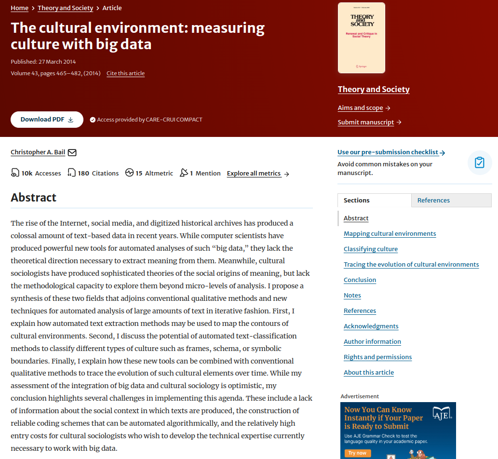
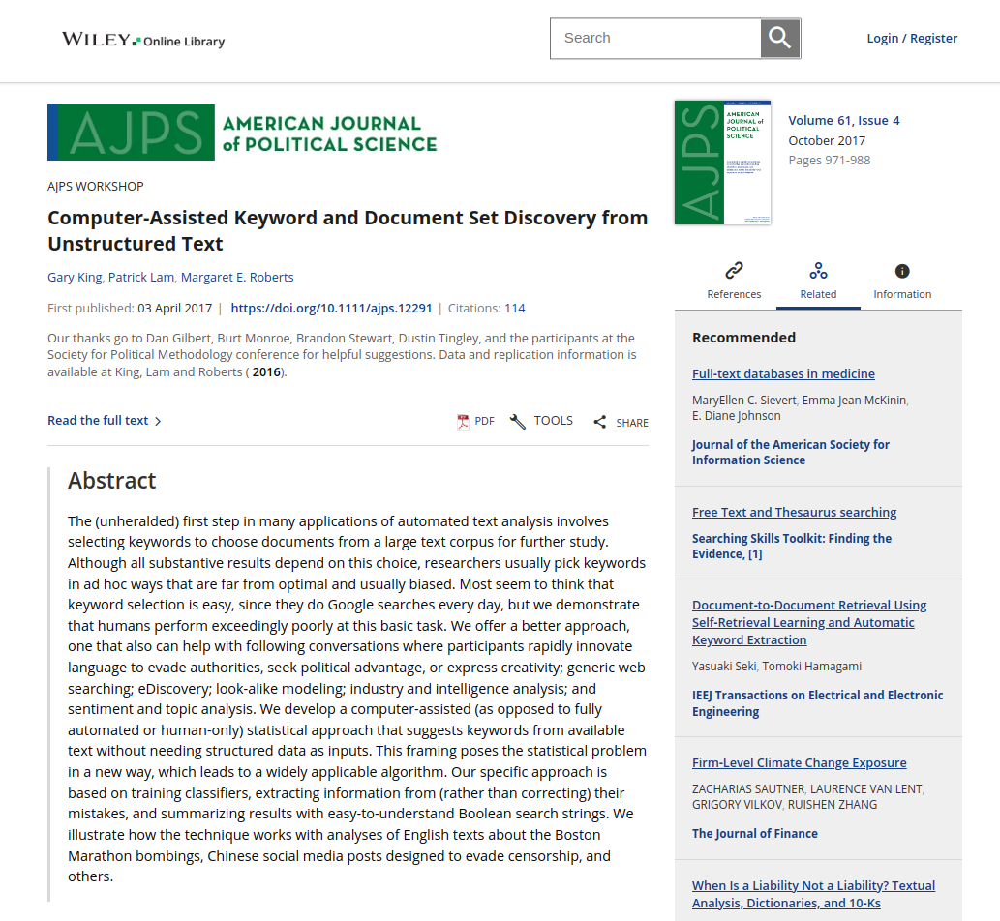

```{r setup, include=FALSE}
options(htmltools.dir.version = FALSE)
```

```{r xaringan-themer, include=FALSE}
library(xaringanthemer)
library(xaringanExtra)
use_panelset()


style_duo_accent(
  footnote_color = "#2c8475",
  footnote_position_bottom = "20px",
  footnote_font_size = "0.5em",
  primary_color = "#28282B",
  #primary_color = "#7393B3",
  secondary_color = "#2c8475",
  black_color = "#4242424",
  white_color = "#FFF",
  base_font_size = "25px",
  # text_font_family = "Jost",
  # text_font_url = "https://indestructibletype.com/fonts/Jost.css",
  header_font_google = google_font("Libre Franklin", "200", "400"),
  header_font_weight = "200",
    header_background_color = "#2c8475",
    header_background_text_color = "#2c8475",

  inverse_header_color = "#eaeaea",
  title_slide_text_color = "#FFFFFF",
  text_slide_number_color = "#9a9a9a",
  text_bold_color = "#6A5ACD",
  code_inline_color = "#B56B6F",
  code_highlight_color = "transparent",
  link_color = "#2c8475",
  table_row_even_background_color = lighten_color("#345865", 0.9),
  extra_fonts = list(
    "https://indestructibletype.com/fonts/Jost.css",
    google_font("Amatic SC", "400")
  ),
  colors = c(
    green = "#31b09e",
    "green-dark" = "#2c8475",
    highlight = "#87f9bb",
    purple = "#887ba3",
    pink = "#B56B6F",
    orange = "#f79334",
    red = "#dc322f",
    `blue-dark` = "#002b36",
    `text-dark` = "#202020",
    `text-darkish` = "#424242",
    `text-mild` = "#606060",
    `text-light` = "#9a9a9a",
    `text-lightest` = "#eaeaea"
  ),
  extra_css = list(
    ".remark-slide-content h3" = list(
      "margin-bottom" = 0, 
      "margin-top" = 0
    ),
    ".smallish, .smallish .remark-code-line" = list(`font-size` = "0.7em")
  )
)
xaringanExtra::use_xaringan_extra(c("tile_view", "animate_css", "tachyons", "share_again"))
xaringanExtra::use_extra_styles()

```

```{r metadata, echo=FALSE}
library(metathis)
meta() %>% 
  meta_description("Investigación Social en la era digital, Universidad Católica del Maule, Agosto 01, 2023") %>% 
  meta_social(
    title = "Investigación Social en la era digital",
    url = "https://github.com/rcantillan/slides/tree/main/ciencias-sociales-computacionales/intro",
    image = "https://github.com/rcantillan/slides/tree/main/ciencias-sociales-computacionales/intro/ciencias-sociales-computacionales.png",
    twitter_card_type = "summary_large_image",
    twitter_creator = "ricantillan"
  )
```


```{r components, include=FALSE}
slides_from_images <- function(
  path,
  regexp = NULL,
  class = "hide-count",
  background_size = "contain",
  background_position = "top left"
) {
  if (isTRUE(getOption("slide_image_placeholder", FALSE))) {
    return(glue::glue("Slides to be generated from [{path}]({path})"))
  }
  if (fs::is_dir(path)) {
    imgs <- fs::dir_ls(path, regexp = regexp, type = "file", recurse = FALSE)
  } else if (all(fs::is_file(path) && fs::file_exists(path))) {
    imgs <- path
  } else {
    stop("path must be a directory or a vector of images")
  }
  imgs <- fs::path_rel(imgs, ".")
  breaks <- rep("\n---\n", length(imgs))
  breaks[length(breaks)] <- ""

  txt <- glue::glue("
  class: {class}
  background-image: url('{imgs}')
  background-size: {background_size}
  background-position: {background_position}
  {breaks}
  ")

  paste(txt, sep = "", collapse = "")
}
options("slide_image_placeholder" = FALSE)
```

class: left title-slide
background-image: url('d-koi-GQJY4UPR21U-unsplash.jpg')
background-size: cover
background-position: left

[remarkjs]: https://github.com/gnab/remark
[remark-wiki]: https://github.com/gnab/remark/wiki
[xaringan]: https://slides.yihui.org/xaringan/
[xaringan-wiki]: https://github.com/yihui/xaringan/wiki
[xaringanthemer]: https://pkg.garrickadenbuie.com/xaringanthemer
[xaringanExtra]: https://pkg.garrickadenbuie.com/xaringanExtra
[metathis]: https://pkg.garrickadenbuie.com/metathis
[ricantillan]: https://twitter.com/ricantillan
[rbind]: https://ricantillan.rbind.io
[rsthemes]: https://www.garrickdenbuie.com/projects/rsthemes
[regexplain]: https://www.garrickdenbuie.com/projects/regexplain
[shrtcts]: https://pkg.garricakdenbuie.com/shrtcts


## **Introducción a las Ciencias Sociales <br> Computacionales <br> Clase V**

.side-text[
[&commat;ricantillan][ricantillan] | [rcantillan.rbind.io][rbind]
]

.title-where[
Universidad Católica del Maule<br>
Agosto 08, 2024
]

```{css echo=FALSE}
.title-slide h1 {
  font-size: 80px;
  font-family: Jost, sans;
  color: #6A5ACD;  /* Cambio del color del texto a morado */
}

.side-text {
  color: #6A5ACD;  /* Cambio del color del texto lateral a morado */
  transform: rotate(90deg);
  position: absolute;
  font-size: 22px;
  top: 150px;
  right: -130px;
}

.side-text a {
  color: #6A5ACD;  /* Cambio del color de los enlaces a morado */
}

.title-where {
  font-family: Jost, sans;
  font-size: 25px;
  position: absolute;
  bottom: 10px;
  color: #6A5ACD;  /* Cambio del color del texto de ubicación a morado */
}

/******************
 * 
 * Coloured content boxes
 *
 ****************/


.content-box { 
    box-sizing: content-box;
    	background-color: #e2e2e2;
  /* Total width: 160px + (2 * 20px) + (2 * 8px) = 216px
     Total height: 80px + (2 * 20px) + (2 * 8px) = 136px
     Content box width: 160px
     Content box height: 80px */
}

.content-box-primary,
.content-box-secondary,
.content-box-blue,
.content-box-gray,
.content-box-grey,
.content-box-army,
.content-box-green,
.content-box-purple,
.content-box-red,
.content-box-yellow {
    /*border-radius: 15px; */
    margin: 0 0 25px;
    overflow: hidden;
    padding: 20px;
    width: 100%;
}


.content-box-primary {
	background-color: var(--primary);

}


.content-box-secondary {
	background-color: var(--secondary);

}

.content-box-blue {
    background-color: #F0F8FF;

}

.content-box-gray {
    background-color: #e2e2e2;
}

.content-box-grey {
	background-color: #F5F5F5;
}

.content-box-army {
	background-color: #737a36;
}

.content-box-green {
	background-color: #d9edc2;
}

.content-box-purple {
	background-color: #e2e2f9;
}

.content-box-red {
	background-color: #f9dbdb;
}

.content-box-yellow {
	background-color: #fef5c4;
}


.full-width {
    display: flex;
    width: 100%;
    flex: 1 1 auto;
}

```


```{r logo, echo=FALSE}
#library(xaringanExtra)
#use_logo(
#  image_url = "download.png",
#  exclude_class = c("title-slide","hide_logo","inverse"),
#  width = "150px",
#  height = "150px")
```

---
class: middle left 
 
## **Introducción al análisis de contenido digital**

### **¿Qué es el análisis de contenido digital?**

- Método para examinar y extraer significado de textos y datos en línea
- Aplicable a redes sociales, blogs, foros, noticias digitales, etc.
- Combina técnicas tradicionales con métodos computacionales

---

class: middle left


```{r, echo = FALSE}
knitr::include_url("https://www.tidytextmining.com/")
```

[Texto O'REILLY](https://www.tidytextmining.com/)


---

class: middle left

.w-50.fl[
### 



]

.w-50.fr[
### 



]


---
class: middle left 

### **Evolución del análisis de contenido**

.full-width[.content-box-purple[
- De lo analógico a lo digital
- Mayor escala y velocidad de análisis
- Nuevas formas de datos: hashtags, emojis, hipertexto
]]

---
class: middle left 

### **Principales aplicaciones**

- Análisis de sentimientos
- Detección de temas emergentes
- Estudio de dinámicas de difusión de información
- Análisis de discurso político en línea

---

class: middle left 

## **Potencial del análisis de texto a gran escala**

.full-width[.content-box-purple[
.bolder[**Ventajas del análisis a gran escala**]:
- Mayor representatividad y diversidad de datos
- Detección de patrones sutiles o emergentes
- Análisis longitudinal y en tiempo real
- Reducción de sesgos del investigador
]]


---

class: middle left 

### **Casos de estudio**

.panelset[
.panel[.panel-name[**Política**]
- Análisis de millones de tweets para predecir resultados electorales
- Estudio de polarización política en redes sociales
]
.panel[.panel-name[**Salud Pública**]
- Detección temprana de brotes epidémicos mediante búsquedas web
- Análisis de discusiones en línea sobre vacunas
]
.panel[.panel-name[**Mercadotecnia**]
- Monitoreo de reputación de marca en tiempo real
- Identificación de tendencias de consumo emergentes
]
]


---

class: middle left 

## **Herramientas y técnicas**

- Procesamiento de Lenguaje Natural (NLP)
- Modelado de Tópicos
- Análisis de Redes
- Aprendizaje Automático


---

class: middle left 

### **Limitaciones del análisis de texto a gran escala**

.full-width[.content-box-purple[
.bolder[**Desafíos metodológicos**]
- Representatividad de las muestras en línea
- Sesgos algorítmicos y de plataforma
- Dificultad para capturar contexto y significados sutiles
- Problemas de privacidad y ética
]]


---
class: middle left 

## **El problema de la "caja negra"**

- Complejidad de los algoritmos de ML
- Dificultad de interpretación
- Riesgo de conclusiones espurias

---
class: middle left 

## **Limitaciones lingüísticas**

- Variabilidad del lenguaje en línea
- Sarcasmo, ironía y lenguaje figurado
- Multilingüismo y variaciones dialectales

---
class: middle left 

## **Consideraciones metodológicas**

.full-width[.content-box-purple[
.bolder[**Diseño de investigación**]
- Definición clara de preguntas de investigación
- Selección adecuada de fuentes de datos
- Consideración de sesgos potenciales
- Triangulación con métodos tradicionales
]]

---

class: middle left 

## **Preprocesamiento de datos**

- Limpieza y normalización de texto
- Manejo de datos faltantes o ruidosos
- Tokenización y lematización
- Eliminación de stop words

---
class: middle left 

## **Validación y confiabilidad**

- Uso de conjuntos de datos de entrenamiento etiquetados manualmente
- Evaluación cruzada y pruebas de robustez
- Interpretación cuidadosa de resultados
- Transparencia en el reporte de métodos y limitaciones

---
class: middle left 

## **Conclusiones**

### **El futuro del análisis de contenido digital**

- Integración de métodos cuantitativos y cualitativos
- Desarrollo de enfoques multimodales (texto, imagen, video)
- Avances en IA para mejorar la interpretación contextual
- Mayor énfasis en ética y responsabilidad algorítmica

---

class: middle left 

## **Reflexiones finales**

- El análisis de contenido digital ofrece oportunidades sin precedentes
- Requiere un enfoque crítico y reflexivo
- Necesidad de colaboración interdisciplinaria
- Importancia de la formación continua en métodos computacionales

---

class: middle left 

## **Referencias**

- Bail, C. A. (2014). The cultural environment: Measuring culture with big data. Theory and Society, 43(3-4), 465-482.

- Grimmer, J., & Stewart, B. M. (2013). Text as data: The promise and pitfalls of automatic content analysis methods for political texts. Political Analysis, 21(3), 267-297.

- King, G., Lam, P., & Roberts, M. E. (2017). Computer-assisted keyword and document set discovery from unstructured text. American Journal of Political Science, 61(4), 971-988.

- Lazer, D., & Radford, J. (2017). Data ex machina: Introduction to big data. Annual Review of Sociology, 43, 19-39.

- Silge, J., & Robinson, D. (2017). Text mining with R: A tidy approach. O'Reilly Media.


---
class: middle right
background-image: url('d-koi-GQJY4UPR21U-unsplash.jpg')
background-size: cover

# **Muchas Gracias**
### **Esta presentación fue realizada con el paquete  [Xaringan](https://slides.yihui.org/xaringan), diseñado para entorno  [R](https://www.r-project.org/)** 


