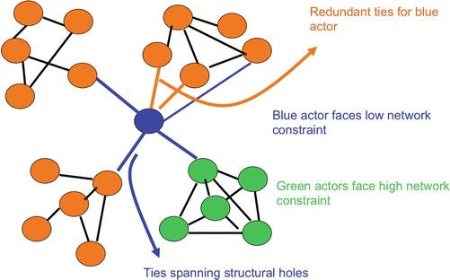

```{r setup, include=FALSE}
options(htmltools.dir.version = FALSE)
```

```{r xaringan-themer, include=FALSE}
library(xaringanthemer)
library(xaringanExtra)
use_panelset()


style_duo_accent(
  footnote_color = "#2c8475",
  footnote_position_bottom = "20px",
  footnote_font_size = "0.5em",
  primary_color = "#28282B",
  #primary_color = "#7393B3",
  secondary_color = "#2c8475",
  black_color = "#4242424",
  white_color = "#FFF",
  base_font_size = "25px",
  # text_font_family = "Jost",
  # text_font_url = "https://indestructibletype.com/fonts/Jost.css",
  header_font_google = google_font("Libre Franklin", "200", "400"),
  header_font_weight = "200",
    header_background_color = "#2c8475",
    header_background_text_color = "#2c8475",

  inverse_header_color = "#eaeaea",
  title_slide_text_color = "#FFFFFF",
  text_slide_number_color = "#9a9a9a",
  text_bold_color = "#6A5ACD",
  code_inline_color = "#B56B6F",
  code_highlight_color = "transparent",
  link_color = "#2c8475",
  table_row_even_background_color = lighten_color("#345865", 0.9),
  extra_fonts = list(
    "https://indestructibletype.com/fonts/Jost.css",
    google_font("Amatic SC", "400")
  ),
  colors = c(
    green = "#31b09e",
    "green-dark" = "#2c8475",
    highlight = "#87f9bb",
    purple = "#887ba3",
    pink = "#B56B6F",
    orange = "#f79334",
    red = "#dc322f",
    `blue-dark` = "#002b36",
    `text-dark` = "#202020",
    `text-darkish` = "#424242",
    `text-mild` = "#606060",
    `text-light` = "#9a9a9a",
    `text-lightest` = "#eaeaea"
  ),
  extra_css = list(
    ".remark-slide-content h3" = list(
      "margin-bottom" = 0, 
      "margin-top" = 0
    ),
    ".smallish, .smallish .remark-code-line" = list(`font-size` = "0.7em")
  )
)
xaringanExtra::use_xaringan_extra(c("tile_view", "animate_css", "tachyons", "share_again"))
xaringanExtra::use_extra_styles()

```

```{r metadata, echo=FALSE}
library(metathis)
meta() %>% 
  meta_description("Investigación Social en la era digital, Universidad Católica del Maule, Agosto 01, 2023") %>% 
  meta_social(
    title = "Investigación Social en la era digital",
    url = "https://github.com/rcantillan/slides/tree/main/ciencias-sociales-computacionales/intro",
    image = "https://github.com/rcantillan/slides/tree/main/ciencias-sociales-computacionales/intro/ciencias-sociales-computacionales.png",
    twitter_card_type = "summary_large_image",
    twitter_creator = "ricantillan"
  )
```


```{r components, include=FALSE}
slides_from_images <- function(
  path,
  regexp = NULL,
  class = "hide-count",
  background_size = "contain",
  background_position = "top left"
) {
  if (isTRUE(getOption("slide_image_placeholder", FALSE))) {
    return(glue::glue("Slides to be generated from [{path}]({path})"))
  }
  if (fs::is_dir(path)) {
    imgs <- fs::dir_ls(path, regexp = regexp, type = "file", recurse = FALSE)
  } else if (all(fs::is_file(path) && fs::file_exists(path))) {
    imgs <- path
  } else {
    stop("path must be a directory or a vector of images")
  }
  imgs <- fs::path_rel(imgs, ".")
  breaks <- rep("\n---\n", length(imgs))
  breaks[length(breaks)] <- ""

  txt <- glue::glue("
  class: {class}
  background-image: url('{imgs}')
  background-size: {background_size}
  background-position: {background_position}
  {breaks}
  ")

  paste(txt, sep = "", collapse = "")
}
options("slide_image_placeholder" = FALSE)
```

class: left title-slide
background-image: url('d-koi-GQJY4UPR21U-unsplash.jpg')
background-size: cover
background-position: left

[remarkjs]: https://github.com/gnab/remark
[remark-wiki]: https://github.com/gnab/remark/wiki
[xaringan]: https://slides.yihui.org/xaringan/
[xaringan-wiki]: https://github.com/yihui/xaringan/wiki
[xaringanthemer]: https://pkg.garrickadenbuie.com/xaringanthemer
[xaringanExtra]: https://pkg.garrickadenbuie.com/xaringanExtra
[metathis]: https://pkg.garrickadenbuie.com/metathis
[ricantillan]: https://twitter.com/ricantillan
[rbind]: https://ricantillan.rbind.io
[rsthemes]: https://www.garrickdenbuie.com/projects/rsthemes
[regexplain]: https://www.garrickdenbuie.com/projects/regexplain
[shrtcts]: https://pkg.garricakdenbuie.com/shrtcts


## **Introducción a las Ciencias Sociales <br> Computacionales <br> Clase VI**

.side-text[
[&commat;ricantillan][ricantillan] | [rcantillan.rbind.io][rbind]
]

.title-where[
Universidad Católica del Maule<br>
Agosto 08, 2024
]

```{css echo=FALSE}
.title-slide h1 {
  font-size: 80px;
  font-family: Jost, sans;
  color: #6A5ACD;  /* Cambio del color del texto a morado */
}

.side-text {
  color: #6A5ACD;  /* Cambio del color del texto lateral a morado */
  transform: rotate(90deg);
  position: absolute;
  font-size: 22px;
  top: 150px;
  right: -130px;
}

.side-text a {
  color: #6A5ACD;  /* Cambio del color de los enlaces a morado */
}

.title-where {
  font-family: Jost, sans;
  font-size: 25px;
  position: absolute;
  bottom: 10px;
  color: #6A5ACD;  /* Cambio del color del texto de ubicación a morado */
}

/******************
 * 
 * Coloured content boxes
 *
 ****************/


.content-box { 
    box-sizing: content-box;
    	background-color: #e2e2e2;
  /* Total width: 160px + (2 * 20px) + (2 * 8px) = 216px
     Total height: 80px + (2 * 20px) + (2 * 8px) = 136px
     Content box width: 160px
     Content box height: 80px */
}

.content-box-primary,
.content-box-secondary,
.content-box-blue,
.content-box-gray,
.content-box-grey,
.content-box-army,
.content-box-green,
.content-box-purple,
.content-box-red,
.content-box-yellow {
    /*border-radius: 15px; */
    margin: 0 0 25px;
    overflow: hidden;
    padding: 20px;
    width: 100%;
}


.content-box-primary {
	background-color: var(--primary);

}


.content-box-secondary {
	background-color: var(--secondary);

}

.content-box-blue {
    background-color: #F0F8FF;

}

.content-box-gray {
    background-color: #e2e2e2;
}

.content-box-grey {
	background-color: #F5F5F5;
}

.content-box-army {
	background-color: #737a36;
}

.content-box-green {
	background-color: #d9edc2;
}

.content-box-purple {
	background-color: #e2e2f9;
}

.content-box-red {
	background-color: #f9dbdb;
}

.content-box-yellow {
	background-color: #fef5c4;
}


.full-width {
    display: flex;
    width: 100%;
    flex: 1 1 auto;
}

```


```{r logo, echo=FALSE}
#library(xaringanExtra)
#use_logo(
#  image_url = "download.png",
#  exclude_class = c("title-slide","hide_logo","inverse"),
#  width = "150px",
#  height = "150px")
```

---
class: middle left


### **Contenidos de la sesión**

  - Introducción
  - Principios y métodos
  - Orígenes
  - En latinoamérica
  - Usos Actuales


---

class: middle left

### **Introducción**

- "To be social means to be connected to others" [1]
- El objetivo principal del análisis de redes sociales es construir y evaluar teorías de la estructura social. 
- La estructura social se define como patrones duraderos de interacción humana y formas de pensar sobre y organizar grupos humanos.
- Relational strutcure / Normative stucture [2]
- Barabási amplía esta definición destacando que estamos rodeados de sistemas complejos, desde la sociedad que requiere cooperación entre miles de millones de individuos, hasta las infraestructuras de comunicación que integran miles de millones de teléfonos móviles con ordenadores y satélites [3].


.footnote[
[1] Blau, P. M. (1977). Inequality and Heterogeneity: A Primitive Theory of Social Structure. New York: Free Press.

[2] López, J., & Scott, J. (2000). Social structure. Open University Press.

[3] Barabási, A. L. (2016). Network Science. Cambridge University Press.

]

---

class: left middle

### **Estrategias epistemológicas: Heterarquía**

.w-50.fl[
### 

- La estrategia de reducción (elementarismo propiamente dicho)
- La estrategia de construcción o emergencia compositiva
- La estrategia de la heterarquía o emergencia heterárquica
- La estrategia de la jerarquía o emergencia jerárquica
- La estrategia de la trascendencia sistémica (holismo propiamente dicho)

]

.w-50.fr[
### 

```{r out.width = '80%', echo = FALSE, fig.align = 'center'}
 
```

]

.footnote[
[1] Kontopoulos, K. M. (1993). The Logics of Social Structure. Cambridge University Press.

]

---

class: left middle

.w-50.fl[
### 

### **Structural Theory of Action**

1. Capturing an actor's position in a stratified system as the social context of evaluation
2. Describing the manner in which actor interests are patterned by social structure so captured
3. Describing the manner in which actions, determined by interests, are constrained by the relational pattern defining a position in social structure
4. Describing the manner in which actors pursuing their interests in theproposed manner could be responsible for the patterns of relations first observed as social structure

]

.w-50.fr[
### 

```{r out.width = '90%', echo = FALSE, fig.align = 'center'}
 
```


]

.footnote[

[1] Burt, R. S. (1982). Toward a structural theory of action: Network models of social structure, perception, and action. Academic Press.

]

---

class: middle left

### **Principios**


.w-50.fl[
### 


]

.w-50.fr[
### 


]

---

class: middle left 

### **Principios**

.panelset[
.panel[.panel-name[**Knoke, D. (1994)**]
- Las propiedades estructurales de las formaciones sociales son contextos que dan forma a las percepciones, creencias, actitudes y acciones de individuos y colectividades.

- La influencia social y la acción colectiva pueden ser facilitadas y / o restringidas por intercambios (transacciones) directos e indirectos entre actores sociales que poseen recursos diferenciales.

- La incrustación o arraigo (ubicación de los actores dentro de contextos situacionales reales) debe analizarse como procesos dinámicos
]
.panel[.panel-name[**Wellman, B.**]

- El comportamiento es interpretado en términos de restricciones antes que en términos de fuerzas internas existentes en las unidades (límites y oportunidades)

- El análisis se centra en las relaciones entre las unidades y no en la clasificación de las unidades por categoría definida por atributos internos (o esencias) de dichas unidades.

- Una preocupación central es la manera en que los patrones de relaciones entre múltiples alter afectan, en conjunto, el comportamiento de los miembros de la red. Por lo tanto, no se asume que los miembros de la red sólo participan en múltiples diádas con alter separados.

]

.panel[.panel-name[**Wellman, B. II**]

- La estructura es tratada como una red de redes que puede estar, como no, dividida en grupos discretos. No se asume a priori que los grupos frecuentemente cerrados sean, de manera intrínseca, los bloques de construcción de la estructura

- Los métodos analíticos tratan directamente con la naturaleza relacional (modelada en términos de patrones) de la estructura social, para así completar, y a veces sustituir, los principales métodos estadísticos que requieren de unidades independientes de análisis.

]
]

---

class: middle left 


.full-width[.content-box-purple[
Los enfoques estructural-relacionales contrastan con explicaciones sustancialistas basadas en "conceptos-cosa" como unidad básica de análisis: esencia del actor, autoacción, conformidad normativa, elección racional, enfoques centrados en variables e identidad social (Emirbayer, 1997)
]]


---

class: middle left

### **Teoría y métodos**

La investigación en red implica la interacción continua de herramientas teóricas y metodológicas para investigar una amplia gama de cuestiones sustantivas.

.panelset[
.panel[.panel-name[**Teoría**]
- Relational vs substantive perspectives (Emirbayer 1997)
- Social capital theories (Coleman 1990; Lin 2001)
- Structural holes (Burt 1997)
- Organizational field-nets (Kenis & Knoke 2002)
- Small worlds (Watts, 2004)
- Networks and identity (White, 2008) 
]
.panel[.panel-name[**Método**]

- Métodos algebraicos matriciales (Wasserman & Faust 1994)
- Programas de visualización (Freeman 2000)
- Métodos descriptivos
- Modelos de gráficos aleatorios de familias exponenciales (ERGM)


]

]

---

class: middle left

### **Multidisciplina, multinivel, multiplex**


.w-50.fl[

.full-width[.content-box-purple[
El ARS se ha constituido como una perspectiva **multidisciplinaria**. Su equipaje facilita el análisis de realidades complejas y fenómenos emergentes. De esta manera, abundan análisis **multinivel** (micro, meso y macro) (Lazega, 2015) de realidades **multiplexadas** (constituidas por el solapamiento de múltiples relaciones) (White, 2008), y procesos emergentes como la polarización y la formación de identidades políticas (Baldasarri y Bearman, 2007).  
]]

]

.w-50.fr[

```{r out.width = '100%', echo = FALSE, fig.align = 'center'}
knitr::include_graphics("https://cosnet.bifi.es/wp-content/uploads/2014/06/multiplex_networks_2a.jpg") 
```

]

---

class: middle left

### **Ejemplos de problemas sustantivos abordados con ARS**

- Sistemas personales de soporte social y de salud comunitaria
- Grupos de juegos para niños, camarillas de la escuela secundaria
- Comportamiento vecinal, participación comunitaria
- Grupos de interés, asociaciones voluntarias, movimientos sociales
- Pelotones de combate militar, células terroristas
- Alianzas estratégicas corporativas
- Relaciones internacionales: comercio, ayuda, guerra y paz


---

class: middle, center

## **Orígenes: Motivaciones empíricas**

---

class: middle, left

### **Psicología social de los grupos pequeños**


.pull-left[
```{r out.width = '60%', echo = FALSE, fig.align = 'center'}
knitr::include_graphics("https://encrypted-tbn0.gstatic.com/images?q=tbn%3AANd9GcSEpEzZ4Fa-xX1dOxL1_aSzLYhYCOXBZ2CWVA&usqp=CAU") 
```
]
.pull-right[
```{r out.width = '60%', echo = FALSE, fig.align = 'center'}
knitr::include_graphics("https://i0.wp.com/gnuband.org/images/sna_moreno.gif?w=625") 
```
]

Aunque los antecedentes se encuentran en la década de 1920 (Freeman 1996), Jacob L. Moreno fue pionero en el análisis de redes sociales para su terapia de “psicodrama”. Usó sociomatrices y sociogramas dibujados a mano para mostrar con gráficos dirigidos (dígrafos) los gustos y disgustos entre compañeros de clase. 


---

class: middle, left

### **Moreno** 

.pull-left[


]
.pull-right[

.full-width[.content-box-purple[
"La medición sociométrica comenzó con cosas como esta: ¿cuánto “tiempo” pasa un actor A con otro actor B? Puede pasar la mitad de tiempo con otro actor C y tres veces más tiempo con otro actor D. O, ¿cuál es la "distancia espacial", cerca o lejos, en pulgadas, pies o metros, entre los actores A, B, C y D en el curso de la misma situación y ¿qué efecto tiene la proximidad o la distancia sobre el comportamiento y la actuación? O, ¿con qué frecuencia aparecen dos actores simultáneamente en una escena y con qué frecuencia se juntan?"  
]]

]

---

class: middle, left

### **Complejidad de las sociedades urbanas** 

.pull-left[
- El enfoque tradicional de la antropología en términos de instituciones (economía, religión, politica, parentesco, etc), no eran suficientes para comprender las interacciones fluidas que se despliegan en entornos complejos (Barnes, 1954; Mitchell, 1969). 

- Se comienza a conceptualizar formalmente: ej. densidad (Bott, 1957), alcance (Thurman, 1980), conexión, agrupalidad, y multiplicidad (Kapferer, 1969), centralidad de actor y centralización de  grupo (Bronfenbenner, 1943; Moreno & Jenings, 1945) 
]
.pull-right[
```{r out.width = '60%', echo = FALSE, fig.align = 'center'}
knitr::include_graphics("https://ciberculturauerj.files.wordpress.com/2016/10/captura-de-tela-2016-10-17-15-44-30.png?w=640") 
```
]

---

class: middle, center

## **Orígenes: Motivaciones teóricas**

---

class: middle, left

### **Estructuralismos**

.pull-left[
- **Antropología social**:Los seres humanos están conectados por una compleja red de relaciones sociales. La "estructura social" es esta red de relaciones realmente existentes (Radcliffe-Brown; Polanyi)
  
- **Antropología/etnología**: Estructuras mentales profundas (inconscientes) que determinan nuestra realidad simbólica y cultural (Levi-Strauss)
  
- **Sociológico**: La estructura de interacciones determina la vida socioeconómica  (Marx), instituciones (Durkheim), grupos y afiliaciones (Simmel) y otros fenómenos emergentes. 
]
.pull-right[
```{r out.width = '60%', echo = FALSE, fig.align = 'center'}
knitr::include_graphics("https://pictures.abebooks.com/HATT/20652923400.jpg") 
```
]

---

class: middle, left

### **Grupo social** 

.pull-left[

- **Camarilla** (Luce y Perry, 1949; Alba, 1973; Seidman y Foster, 1978; Mokken, 1979, Freeman, 1988)

- **Comunidad interaccional** (Sailer y Gaulin, 1984)

- **Círculos sociales y estructuras de afiliación** (Feld, 1981; Breiger, 1974; McPherson, 1982)  
]

.pull-right[
```{r out.width = '60%', echo = FALSE, fig.align = 'center'}
 
```
]

---

class: middle, left

### **Grupo social II** 


```{r out.width = '50%', echo = FALSE, fig.align = 'center'}
 
```

---

class: middle, left

### **Equilibrio estructural** 

- **Equilibrio** (Heider, 1946; Newcomb, 1953) 

- **Equilibrio y grafos** (Harary, 1953, 1955)

- **Transitividad** (Holland y Leinhardt, 1972)


---

class: middle, left

### **Equivalencia Estructural** 

- **Rol** (Lorrain y White, 1971; Breiger y Pattison, 1986)

- **Posición** (Burt, 1976; Borgatti y Everett, 1992)

---

class: middle, center

## **Orígenes: Motivaciones matemáticas**

---

class: middle, left

### **Motivaciones matemáticas** 

.pull-left[

- Reciprocidad (Katz y Powell, 1955)

- Grafos y distribuciones de grafos aleatorios (Erdös y Renyi, 1960)

- Modelo algebraicos (Ej. Lattices) (Pattison, 1993)  
]

.pull-right[

```{r out.width = '60%', echo = FALSE, fig.align = 'center'}
knitr::include_graphics("https://www.researchgate.net/profile/Henri_Losoi/publication/309041749/figure/fig4/AS:667790340001792@1536225032401/The-Boolean-lattice-ordered-by-subset-inclusion-has-eight-elements-x-y-z.png") 
```

]

---

class: middle, left

### **En latinoamérica...** 

```{r out.width = '70%', echo = FALSE, fig.align = 'center'}
 
```
 
 
---

class: middle, center

### **Desarrollos teóricos recientes**

---

class: middle left

### **Referencias teóricas I**


.w-50.fl[
### 


]

.w-50.fr[
### 


]

---

class: middle left

### **Referencias Teórica II**


.w-50.fl[
### 


]

.w-50.fr[
### 


]

---

class: middle left

### **Structural Holes** 


.w-50.fl[
### 



]

.w-50.fr[
### 


]

---

class: middle left

## **Agujeros Estructurales**


.panelset[
.panel[.panel-name[**Teoría**]

- Concepto de Ronald Burt para medir el "capital social puente" en redes
- Ausencia de conexiones entre grupos en una red social
- Personas que "llenan" estos agujeros tienen ventajas de información y control
]
.panel[.panel-name[**Restricción**]

- Mide cuánto están conectados entre sí los contactos de un nodo
- Menor restricción = más agujeros estructurales = más oportunidades
]

.panel[.panel-name[**Formula simplificada**]

$\text{Restricción} = \sum_{j}(p_{ij} + \sum_{q} p_{iq}p_{qj})^2$

Donde:
- $p_{ij}$: proporción de recursos que $i$ dedica a $j$ (conexión directa)
- $\sum_{q} p_{iq}p_{qj}$: suma de caminos indirectos de $i$ a $j$ vía otros nodos

]

.panel[.panel-name[**Interpretación**]

- Valores bajos: muchos agujeros estructurales (contactos en grupos desconectados)
- Valores altos: pocos agujeros estructurales (contactos muy interconectados)
]
]

---

class: middle left


```{r, echo = FALSE}
knitr::include_url("https://ruqinren.wordpress.com/2018/03/01/hand-calculation-of-burts-constraint-in-networks/")
```

[link a la web](https://ruqinren.wordpress.com/2018/03/01/hand-calculation-of-burts-constraint-in-networks/
)
 
---


class: middle right
background-image: url('adrien-olichon-9zhsq3o1k60-unsplash.jpg')
background-size: cover

### **Que es una red social?** 


---

class: left middle

.w-50.fl[
### **ARS**

- El análisis de redes sociales operacionaliza el pensamiento estructural.
- Utiliza abstracciones visuales y matemáticas para capturar fenómenos relacionales.
- Ejemplo histórico: El problema de los puentes de Königsberg (Euler, 1736).
  - Demostró la importancia de abstraer la estructura formal de un problema.
]

.w-50.fr[
### 


]
  

.footnote[
Fuente: Capítulo 3, "What Is a Social Network?", Network Science textbook.
]

---

class: left middle


.w-50.fl[
### **Conceptos Fundamentales**

- **Nodos (vértices)**: Objetos en la estructura, representados como puntos.
- **Vínculos (aristas)**: Relaciones entre nodos, representadas como líneas.
- **Grafo**: Visualización de nodos y vínculos.
- **Red**: Definida formalmente como dos conjuntos vinculados: nodos y vínculos.
]

.w-50.fr[
### 


]

.footnote[
Fuente: Sección 3.2, "What Is a Social Network?", Network Science textbook.
]

---

class: left middle


.w-50.fl[
### **Tipos de Redes I**

1. **Redes de un modo**: 
   - Nodos del mismo tipo (ej. personas)
   - Vínculos directos entre nodos

]

.w-50.fr[
### 


]


---
class: left middle

.w-50.fl[
### **Tipos de Redes II**

2. **Redes de dos modos (bipartitas)**:
   - Dos tipos de nodos (ej. personas y eventos)
   - Vínculos entre nodos de diferentes tipos

]

.w-50.fr[
### 


]

---

class: left middle

### **Propiedades de los Vínculos**

- **Dirección**: Dirigidos (asimétricos) vs. No dirigidos (simétricos)
- **Valor**: Binarios (presencia/ausencia) vs. Valorados (con peso)

Combinación de estas propiedades resulta en cuatro tipos de redes:
1. No dirigidas, binarias
2. Dirigidas, binarias
3. No dirigidas, valoradas
4. Dirigidas, valoradas


---

class: left middle

### **Conceptos de Conectividad**

- **Caminata (Walk)**: Secuencia de nodos y vínculos (puede repetir nodos)
- **Camino (Path)**: Secuencia sin repetir nodos
- **Ciclo**: Camino que empieza y termina en el mismo nodo
- **Distancia (geodésica)**: Número de vínculos en el camino más corto entre dos nodos
- **Densidad**: Proporción de vínculos existentes sobre el total posible

---

class: left middle

### **Representaciones Matemáticas de Redes**

1. **Matriz de Adyacencia**:
   - Matriz cuadrada $n$ x $n$ (n = número de nodos)
   - $X_{ij}$ representa el vínculo entre $i$ y $j$
   - Simétrica para redes no dirigidas

2. **Lista de Vínculos (Edgelist)**:
   - Cada fila representa un vínculo
   - Columnas: nodo origen, nodo destino (y valor si es valorada)

3. **Lista de Adyacencia**:
   - Cada nodo listado con sus nodos adyacentes
   - Eficiente para algoritmos de búsqueda de caminos


---

class: left middle

### **Ejemplo: Matriz de Adyacencia**

.pull-left[
Matriz para una red de 5 nodos:

|   | A | B | C | D | E |
|---|---|---|---|---|---|
| A | 0 | 1 | 0 | 1 | 0 |
| B | 1 | 0 | 1 | 0 | 1 |
| C | 0 | 1 | 0 | 1 | 0 |
| D | 1 | 0 | 1 | 0 | 0 |
| E | 0 | 1 | 0 | 0 | 0 |
]

.pull-right[
- 0 indica ausencia de vínculo
- 1 indica presencia de vínculo
- La diagonal principal es 0 (sin auto-vínculos)
- Es simétrica para redes no dirigidas
]


---

class: left middle

### **Ejemplo: Lista de Vínculos (Edgelist)**

.pull-left[
Lista para la misma red de 5 nodos:

| Origen | Destino |
|--------|---------|
| A      | B       |
| A      | D       |
| B      | C       |
| B      | E       |
| C      | D       |
]

.pull-right[
- Cada fila representa un vínculo
- Más eficiente en espacio para redes dispersas
- Fácil de extender para redes valoradas o multi-relacionales
]


---

class: left middle

### **Ejemplo: Lista de Adyacencia**

.pull-left[
Lista para la misma red de 5 nodos:

| Nodo | Adyacentes |
|------|------------|
| A    | B, D       |
| B    | A, C, E    |
| C    | B, D       |
| D    | A, C       |
| E    | B          |
]

.pull-right[
- Cada nodo listado con sus vecinos
- Eficiente para algoritmos de búsqueda
- Útil para redes con grados muy variables
]


---
class: middle right
background-image: url('d-koi-GQJY4UPR21U-unsplash.jpg')
background-size: cover

# **Muchas Gracias**
### **Esta presentación fue realizada con el paquete  [Xaringan](https://slides.yihui.org/xaringan), diseñado para entorno  [R](https://www.r-project.org/)** 


