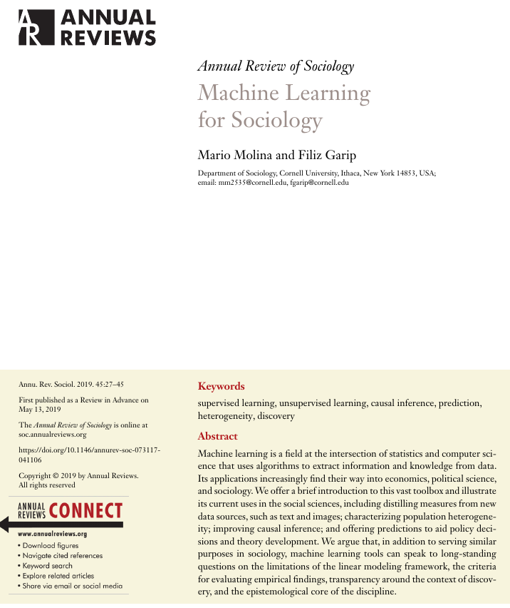
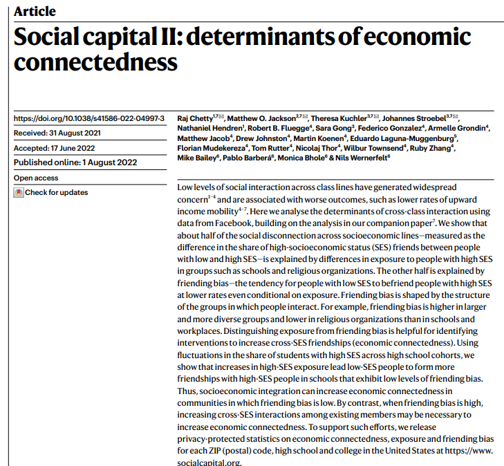
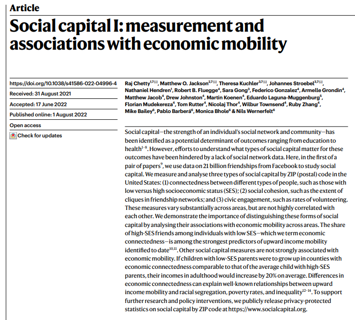

```{r setup, include=FALSE}
options(htmltools.dir.version = FALSE)
```

```{r xaringan-themer, include=FALSE}
library(xaringanthemer)
library(xaringanExtra)
use_panelset()


style_duo_accent(
  footnote_color = "#2c8475",
  footnote_position_bottom = "20px",
  footnote_font_size = "0.5em",
  primary_color = "#28282B",
  #primary_color = "#7393B3",
  secondary_color = "#2c8475",
  black_color = "#4242424",
  white_color = "#FFF",
  base_font_size = "25px",
  # text_font_family = "Jost",
  # text_font_url = "https://indestructibletype.com/fonts/Jost.css",
  header_font_google = google_font("Libre Franklin", "200", "400"),
  header_font_weight = "200",
    header_background_color = "#2c8475",
    header_background_text_color = "#2c8475",

  inverse_header_color = "#eaeaea",
  title_slide_text_color = "#FFFFFF",
  text_slide_number_color = "#9a9a9a",
  text_bold_color = "#6A5ACD",
  code_inline_color = "#B56B6F",
  code_highlight_color = "transparent",
  link_color = "#2c8475",
  table_row_even_background_color = lighten_color("#345865", 0.9),
  extra_fonts = list(
    "https://indestructibletype.com/fonts/Jost.css",
    google_font("Amatic SC", "400")
  ),
  colors = c(
    green = "#31b09e",
    "green-dark" = "#2c8475",
    highlight = "#87f9bb",
    purple = "#887ba3",
    pink = "#B56B6F",
    orange = "#f79334",
    red = "#dc322f",
    `blue-dark` = "#002b36",
    `text-dark` = "#202020",
    `text-darkish` = "#424242",
    `text-mild` = "#606060",
    `text-light` = "#9a9a9a",
    `text-lightest` = "#eaeaea"
  ),
  extra_css = list(
    ".remark-slide-content h3" = list(
      "margin-bottom" = 0, 
      "margin-top" = 0
    ),
    ".smallish, .smallish .remark-code-line" = list(`font-size` = "0.7em")
  )
)
xaringanExtra::use_xaringan_extra(c("tile_view", "animate_css", "tachyons", "share_again"))
xaringanExtra::use_extra_styles()

```

```{r metadata, echo=FALSE}
library(metathis)
meta() %>% 
  meta_description("Investigación Social en la era digital, Universidad Católica del Maule, Agosto 01, 2023") %>% 
  meta_social(
    title = "Investigación Social en la era digital",
    url = "https://github.com/rcantillan/slides/tree/main/ciencias-sociales-computacionales/intro",
    image = "https://github.com/rcantillan/slides/tree/main/ciencias-sociales-computacionales/intro/ciencias-sociales-computacionales.png",
    twitter_card_type = "summary_large_image",
    twitter_creator = "ricantillan"
  )
```


```{r components, include=FALSE}
slides_from_images <- function(
  path,
  regexp = NULL,
  class = "hide-count",
  background_size = "contain",
  background_position = "top left"
) {
  if (isTRUE(getOption("slide_image_placeholder", FALSE))) {
    return(glue::glue("Slides to be generated from [{path}]({path})"))
  }
  if (fs::is_dir(path)) {
    imgs <- fs::dir_ls(path, regexp = regexp, type = "file", recurse = FALSE)
  } else if (all(fs::is_file(path) && fs::file_exists(path))) {
    imgs <- path
  } else {
    stop("path must be a directory or a vector of images")
  }
  imgs <- fs::path_rel(imgs, ".")
  breaks <- rep("\n---\n", length(imgs))
  breaks[length(breaks)] <- ""

  txt <- glue::glue("
  class: {class}
  background-image: url('{imgs}')
  background-size: {background_size}
  background-position: {background_position}
  {breaks}
  ")

  paste(txt, sep = "", collapse = "")
}
options("slide_image_placeholder" = FALSE)
```

class: left title-slide
background-image: url('d-koi-GQJY4UPR21U-unsplash.jpg')
background-size: cover
background-position: left

[remarkjs]: https://github.com/gnab/remark
[remark-wiki]: https://github.com/gnab/remark/wiki
[xaringan]: https://slides.yihui.org/xaringan/
[xaringan-wiki]: https://github.com/yihui/xaringan/wiki
[xaringanthemer]: https://pkg.garrickadenbuie.com/xaringanthemer
[xaringanExtra]: https://pkg.garrickadenbuie.com/xaringanExtra
[metathis]: https://pkg.garrickadenbuie.com/metathis
[ricantillan]: https://twitter.com/ricantillan
[rbind]: https://ricantillan.rbind.io
[rsthemes]: https://www.garrickdenbuie.com/projects/rsthemes
[regexplain]: https://www.garrickdenbuie.com/projects/regexplain
[shrtcts]: https://pkg.garricakdenbuie.com/shrtcts


## **Introducción a las Ciencias Sociales <br> Computacionales <br> Clase VII**

.side-text[
[&commat;ricantillan][ricantillan] | [rcantillan.rbind.io][rbind]
]

.title-where[
Universidad Católica del Maule<br>
Agosto 08, 2024
]

```{css echo=FALSE}
.title-slide h1 {
  font-size: 80px;
  font-family: Jost, sans;
  color: #6A5ACD;  /* Cambio del color del texto a morado */
}

.side-text {
  color: #6A5ACD;  /* Cambio del color del texto lateral a morado */
  transform: rotate(90deg);
  position: absolute;
  font-size: 22px;
  top: 150px;
  right: -130px;
}

.side-text a {
  color: #6A5ACD;  /* Cambio del color de los enlaces a morado */
}

.title-where {
  font-family: Jost, sans;
  font-size: 25px;
  position: absolute;
  bottom: 10px;
  color: #6A5ACD;  /* Cambio del color del texto de ubicación a morado */
}

/******************
 * 
 * Coloured content boxes
 *
 ****************/


.content-box { 
    box-sizing: content-box;
    	background-color: #e2e2e2;
  /* Total width: 160px + (2 * 20px) + (2 * 8px) = 216px
     Total height: 80px + (2 * 20px) + (2 * 8px) = 136px
     Content box width: 160px
     Content box height: 80px */
}

.content-box-primary,
.content-box-secondary,
.content-box-blue,
.content-box-gray,
.content-box-grey,
.content-box-army,
.content-box-green,
.content-box-purple,
.content-box-red,
.content-box-yellow {
    /*border-radius: 15px; */
    margin: 0 0 25px;
    overflow: hidden;
    padding: 20px;
    width: 100%;
}


.content-box-primary {
	background-color: var(--primary);

}


.content-box-secondary {
	background-color: var(--secondary);

}

.content-box-blue {
    background-color: #F0F8FF;

}

.content-box-gray {
    background-color: #e2e2e2;
}

.content-box-grey {
	background-color: #F5F5F5;
}

.content-box-army {
	background-color: #737a36;
}

.content-box-green {
	background-color: #d9edc2;
}

.content-box-purple {
	background-color: #e2e2f9;
}

.content-box-red {
	background-color: #f9dbdb;
}

.content-box-yellow {
	background-color: #fef5c4;
}


.full-width {
    display: flex;
    width: 100%;
    flex: 1 1 auto;
}

```


```{r logo, echo=FALSE}
#library(xaringanExtra)
#use_logo(
#  image_url = "download.png",
#  exclude_class = c("title-slide","hide_logo","inverse"),
#  width = "150px",
#  height = "150px")
```

---
class: left middle

### **Introducción conceptual al aprendizaje automático**

- El aprendizaje automático (machine learning) se refiere a algoritmos y modelos estadísticos que las computadoras usan para realizar tareas sin instrucciones explícitas, basándose en patrones e inferencia.

- Tipos principales:
  - **Aprendizaje supervisado** 
  - **Aprendizaje no supervisado**
  - **Aprendizaje por refuerzo**

- Proviene de la intersección entre la estadística, la ciencia de la computación y el conocimiento del dominio específico.

---

class: middle left

.full-width[.content-box-purple[
.bolder[**Aprendizaje automático**]
El aprendizaje automático representa un cambio de paradigma en cómo abordamos el análisis de datos en ciencias sociales, permitiendo descubrir patrones complejos en grandes volúmenes de información.

]]

---

class: middle left


```{r out.width = '50%', echo = FALSE, fig.align = 'center'}
 
```

---

class: middle left 

### **1. Supervised Machine Learning (SML)**

- **Objetivo**: Predicción $(Ŷ)$ basada en inputs $(X)$
- Equilibra ajuste dentro y fuera de la muestra
- Usa regularización para evitar sobreajuste

- **Aplicaciones**:
  - Predicciones para políticas públicas
  - Mejora de inferencia causal
  - Identificación de efectos de tratamiento heterogéneos

---

class: middle left

.full-width[.content-box-purple[
.bolder[**SML**]
SML se enfoca en predecir un resultado basado en datos de entrenamiento. Utiliza técnicas como regularización para evitar el sobreajuste y busca un equilibrio entre el ajuste dentro de la muestra y la capacidad de generalización.

]]


---

class: middle left


### **2. Unsupervised Machine Learning (UML)**

- **Objetivo**: Descubrir estructuras en los datos
- No hay variable objetivo predefinida

- **Técnicas**:
  - Análisis de componentes principales
  - Análisis de conglomerados
  - Modelado de tópicos
  
- **Aplicaciones**:
  - Caracterización de heterogeneidad poblacional
  - Descubrimiento de patrones latentes

---

class: middle left

.full-width[.content-box-purple[
.bolder[**UML**]
UML busca encontrar patrones o estructuras en los datos sin una variable objetivo específica. Es útil para descubrir grupos o relaciones no evidentes en los datos.

]]


---

class: middle left

## **3. Mejora de Métodos Estadísticos Tradicionales**

- Complementa enfoques estadísticos clásicos
- Permite considerar más variables y relaciones complejas
- Ayuda a superar limitaciones del modelado lineal
- Facilita la exploración de datos y generación de hipótesis

---

class: middle left

.full-width[.content-box-purple[
.bolder[**Aprendizaje automático**]
El aprendizaje automático puede mejorar los métodos estadísticos tradicionales al permitir el análisis de relaciones más complejas y un mayor número de variables.

]]


---

class: middle left

## **4. Aplicaciones en Sociología**

- Predicciones para políticas públicas / predicción de comportamientos y outcomes sociales
- Refinamiento de métodos de inferencia causal
- Caracterización de heterogeneidad poblacional / Segmentación de poblaciones
- Exploración y descubrimiento de patrones en datos / Detección de patrones en redes sociales 
- Clasificación de textos y análisis de sentimientos / Análisis de nuevas fuentes de datos (texto, imágenes)
- Reconocimiento de imágenes en estudios culturales


---

class: middle, center

## **Ejemplos**


---


class: left middle

### **Ejemplo: Predicción de movilidad social**

Chetty et al. (2020) utilizaron técnicas de aprendizaje automático para predecir la movilidad económica intergeneracional en EE.UU.:

- Datos: Registros fiscales de millones de familias
- Métodos: Árboles de decisión, bosques aleatorios, redes neuronales
- Hallazgos: Identificaron factores predictivos clave como segregación racial y calidad escolar


---

class: middle left

.full-width[.content-box-purple[
.bolder[**Sin precedentes**]
Este estudio demuestra el potencial del aprendizaje automático para abordar preguntas sociológicas fundamentales a una escala sin precedentes.
]]


---

class: middle left

```{r, echo = FALSE}
knitr::include_url("https://opportunityatlas.org/")
```

[web](https://opportunityatlas.org/)


---

class: middle left 

.w-50.fl[
```{r out.width = '70%', echo = FALSE, fig.align = 'center'}
 
```
]

.w-50.fr[
### 

```{r out.width = '70%', echo = FALSE, fig.align = 'center'}
 
```

]

.footnote[
[1] Chetty, R., Jackson, M. O., Kuchler, T., Stroebel, J., Hendren, N., Fluegge, R. B., Gong, S., Gonzalez, F., Grondin, A., Jacob, M., Johnston, D., Koenen, M., Laguna-Muggenburg, E., Mudekereza, F., Rutter, T., Thor, N., Townsend, W., Zhang, R., Bailey, M., … Wernerfelt, N. (2022). Social capital I: Measurement and associations with economic mobility. Nature, 608(7921), 108–121. https://doi.org/10.1038/s41586-022-04996-4

[2] Chetty, R., Jackson, M. O., Kuchler, T., Stroebel, J., Hendren, N., Fluegge, R. B., Gong, S., Gonzalez, F., Grondin, A., Jacob, M., Johnston, D., Koenen, M., Laguna-Muggenburg, E., Mudekereza, F., Rutter, T., Thor, N., Townsend, W., Zhang, R., Bailey, M., … Wernerfelt, N. (2022). Social capital II: Determinants of economic connectedness. Nature, 608(7921), 122–134. https://doi.org/10.1038/s41586-022-04997-3

]


---

class: middle left

```{r, echo = FALSE}
knitr::include_url("https://www.socialcapital.org/")
```

[web](https://www.socialcapital.org/)


---

class: left middle

### **Desafíos éticos**

1. Sesgo y equidad algorítmica
2. Privacidad y consentimiento informado
3. Interpretabilidad de modelos "caja negra"
4. Reproducibilidad de resultados
5. Impacto social de los sistemas automatizados

---

class: middle left

### **Consideraciones metodológicas**

- Integración con teoría social:
  - El aprendizaje automático no debe reemplazar, sino complementar la teoría
  - Importancia de la validación cruzada entre métodos cuantitativos y cualitativos

- Transparencia y explicabilidad:
  - Documentar detalladamente los procesos de recolección y preprocesamiento de datos
  - Utilizar técnicas de interpretación de modelos como SHAP values


---

class: left middle

## **Perspectivas futuras**

- Desarrollo de métodos específicos para ciencias sociales
- Mayor énfasis en causalidad y no solo correlación
- Integración de datos heterogéneos (texto, imágenes, redes)
- Colaboraciones interdisciplinarias más estrechas
- Formación especializada para científicos sociales


---
class: middle right
background-image: url('d-koi-GQJY4UPR21U-unsplash.jpg')
background-size: cover

# **Muchas Gracias**
### **Esta presentación fue realizada con el paquete  [Xaringan](https://slides.yihui.org/xaringan), diseñado para entorno  [R](https://www.r-project.org/)** 


